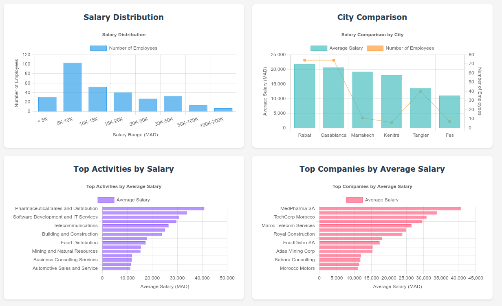
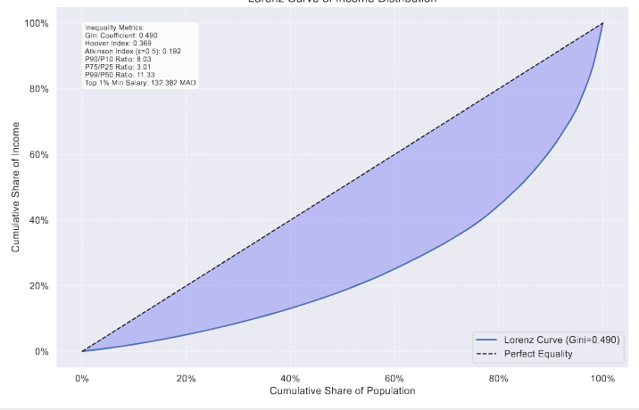

# CNSS Salary Data Analysis System

A full-stack **data engineering and visualization platform** for analyzing salary statistics from CNSS declarations.
Built as a master’s project to demonstrate **ETL pipeline design, database optimization, statistical analysis, and interactive dashboards**.


---

## 🚀 Overview

This project ingests CNSS salary declarations, cleans and loads them into PostgreSQL, and exposes an interactive Flask app for exploratory analysis and automated reporting.

- **Automated ETL**: PDF parsing → cleaning → PostgreSQL
- **Database optimization**: normalization, B-tree indexes, trigram fuzzy search, materialized views
- **Statistics**: Gini, Hoover, Atkinson, Lorenz curves, percentiles (P10–P99.9), deciles
- **Dashboards**: salary distributions, city & industry comparisons, top companies
- **Reports**: one-click PDF with 14+ visualizations

**Tech Stack:** Python, Flask, PostgreSQL, SQLAlchemy, pandas, matplotlib, Chart.js

---

## 🖼️ Screenshots

> 🔍 Advanced Search Interface


### 📊 Visualization Dashboard



### 📈 Top Business Activities by Employees


### 📉 Income Inequality (Lorenz Curve)



---

## ⚙️ Features

**Web Application**

- Multi-criteria **search** with fuzzy text matching (PostgreSQL trigram)
- **Interactive charts** (Chart.js) with filters
- Export options for filtered datasets and charts

**Statistical Analysis**

- Inequality metrics: **Gini**, **Hoover**, **Atkinson**
- **Lorenz** curves, deciles, percentiles
- Automated **PDF report** with plots & summaries

**Data Pipeline**

- PDF parsing with `pdfplumber` + regex
- Cleaning, deduplication, normalization, error handling
- PostgreSQL schema optimized for analytics

---

## 🗄️ Database Schema

```sql
companies (
    company_id SERIAL PRIMARY KEY,
    company_name VARCHAR(255) NOT NULL,
    activity_description TEXT,
    city VARCHAR(100)
);

employees (
    employee_id SERIAL PRIMARY KEY,
    full_name VARCHAR(255) NOT NULL
);

documents (
    document_id SERIAL PRIMARY KEY,
    filename VARCHAR(255) UNIQUE,
    company_id INTEGER REFERENCES companies,
    employee_count INTEGER,
    total_salary_mass DECIMAL(15,2)
);

salary_records (
    record_id SERIAL PRIMARY KEY,
    employee_id INTEGER REFERENCES employees,
    company_id INTEGER REFERENCES companies,
    document_id INTEGER REFERENCES documents,
    salary_amount DECIMAL(10,2) NOT NULL
);
```

### 🔧 Optimizations

- Trigram indexes for fuzzy text search (company & employee names)
- B-tree indexes on foreign keys and salary amounts
- Materialized views for heavy aggregate queries

---

## 🛠️ Installation

### Prerequisites

- Python **3.8+**
- PostgreSQL **12+**
- `pip`

### Setup

```bash
# Clone repository
git clone https://github.com/yourusername/cnss-salary-analysis.git
cd cnss-salary-analysis

# Virtual environment
python3 -m venv venv
source venv/bin/activate   # Windows: venv\Scripts\activate

# Install dependencies
pip install -r requirements.txt

# Create DB (ensure PostgreSQL is running)
createdb cnss_db
psql cnss_db < sql/Tables.sql
psql cnss_db < sql/Indexes.sql
psql cnss_db < sql/Views.sql

# Environment variables
cp .env.example .env   # then edit .env with your credentials
```

### `.env` Example (matches `config.py`)

```env
DB_HOST=localhost
DB_PORT=5432
DB_NAME=cnss_db
DB_USER=your_username
DB_PASSWORD=your_password

FLASK_SECRET_KEY=your-secret-key-here
FLASK_ENV=development
```

### Optional: Load Sample Data

```bash
psql cnss_db < sql/sample_data.sql
```

### Run the App

```bash
python -m src.app
# then open http://localhost:5000
```

---

## 📑 Usage

**Generate Statistical Report**

```bash
python src/generate_report.py
```

Outputs: `visualizations/salary_analysis_report.pdf`

**Example Questions You Can Answer**

- Salary distribution in **Casablanca vs Rabat**
- Industries with the **highest average salaries**
- Share of income going to the **top 10%**
- Correlation between **company size** and salaries
- Current **Gini coefficient** for income inequality

---

## 🧭 Project Structure

```text
cnss-salary-analysis/
├─ src/
│  ├─ app.py
│  ├─ ...               # Flask routes, services, charts API
├─ sql/
│  ├─ Tables.sql
│  ├─ Indexes.sql
│  ├─ Views.sql
│  └─ sample_data.sql
├─ Data Processing/     # ETL scripts
├─ visualizations/      # Generated reports (PDF/PNG)
├─ assets/
│  └─ screenshots/      # UI screenshots used in README
├─ config.py
├─ requirements.txt
├─ README.md
└─ LICENSE
```

---

## 🎓 Project Context

This is a **personal master's project** demonstrating:

- End-to-end **data engineering** (ETL → DB → API → UI)
- **Statistical analysis** & inequality metrics
- **Full-stack development** (Flask + PostgreSQL + JS)
- **Interactive dashboards** for decision-making

---

## 📜 License

MIT License — see [LICENSE](LICENSE)
